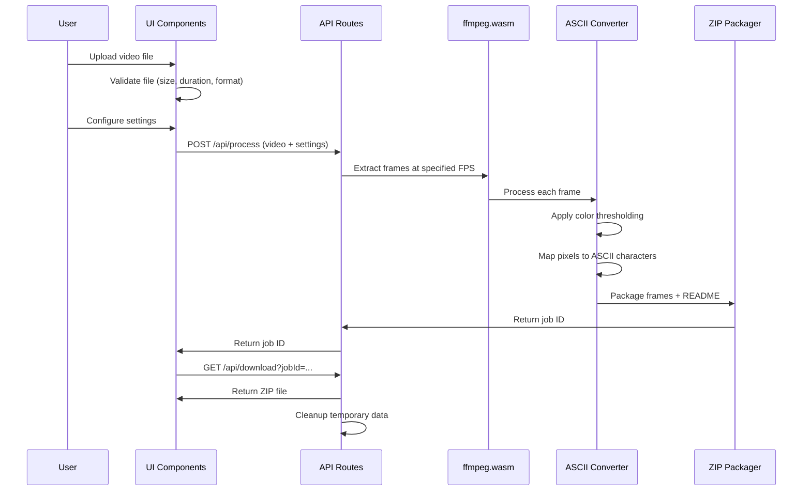

# Design Document

## Overview

The ASCII Frame Generator is a Next.js 15 web application that converts short videos into ASCII art frames using serverless processing. The system leverages ffmpeg.wasm for client-side video processing, implements Ghostty-inspired ASCII conversion algorithms, and provides ephemeral processing with no data persistence. The architecture follows a modern serverless approach with API routes handling the conversion pipeline and client-side components managing the user interface.

## Architecture

### High-Level Architecture

```mermaid
graph TB
    A[Client Browser] --> B[Next.js App Router]
    B --> C[Upload Component]
    B --> D[Settings Panel]
    B --> E[Processing Engine]
    B --> F[Download Component]
    
    E --> G[ffmpeg.wasm Worker]
    E --> H[ASCII Converter]
    E --> I[ZIP Packager]
    
    G --> J[Frame Extraction]
    H --> K[Color Thresholding]
    H --> L[Character Mapping]
    I --> M[JSZip Assembly]
    
    N[API Routes] --> O[/api/process]
    N --> P[/api/download]
    
    Q[Temporary Storage] --> R[In-Memory Processing]
    Q --> S[Cleanup Service]
```

### Processing Pipeline



## Components and Interfaces

### Frontend Components

#### Core UI Components
- **Header.tsx**: Navigation with logo and docs link
- **Footer.tsx**: Minimal footer with attribution and GitHub link
- **UploadArea.tsx**: Drag-and-drop video upload with validation
- **SettingsPanel.tsx**: Configuration interface for conversion parameters
- **ProgressBar.tsx**: Real-time processing progress display
- **DownloadButton.tsx**: ZIP file download interface
- **FramePreview.tsx**: Live preview of ASCII conversion

#### Component Interfaces

```typescript
// UploadArea Component
interface UploadAreaProps {
  onFileSelect: (file: File) => void;
  isProcessing: boolean;
  acceptedFormats: string[];
  maxSize: number;
  maxDuration: number;
}

// SettingsPanel Component
interface SettingsPanelProps {
  settings: ConversionSettings;
  onSettingsChange: (settings: ConversionSettings) => void;
  disabled: boolean;
}

interface ConversionSettings {
  frameRate: 12 | 24;
  resolutionScale: 0.5 | 0.75 | 1.0;
  characterSet: 'default' | 'custom';
  customCharacters?: string;
  colorMode: 'blackwhite' | 'twotone' | 'fullcolor';
  twoToneColors?: [string, string];
  background: 'transparent' | 'black' | 'white';
}

// ProgressBar Component
interface ProgressBarProps {
  progress: number;
  currentFrame: number;
  totalFrames: number;
  status: 'idle' | 'processing' | 'complete' | 'error';
  message?: string;
}
```

### Backend API Design

#### API Route Interfaces

```typescript
// POST /api/process
interface ProcessRequest {
  video: File;
  settings: ConversionSettings;
}

interface ProcessResponse {
  jobId: string;
  totalFrames: number;
  estimatedTime: number;
}

// GET /api/download
interface DownloadRequest {
  jobId: string;
}

// Response: ZIP file stream
```

### Core Processing Libraries

#### ffmpegWorker.ts
```typescript
interface FrameExtractionOptions {
  fps: number;
  scale: number;
  outputFormat: 'png' | 'jpeg';
}

interface ExtractedFrame {
  index: number;
  timestamp: number;
  imageData: Uint8Array;
  width: number;
  height: number;
}

class FFmpegWorker {
  async extractFrames(
    videoBuffer: ArrayBuffer,
    options: FrameExtractionOptions
  ): Promise<ExtractedFrame[]>;
  
  async initialize(): Promise<void>;
  async cleanup(): Promise<void>;
}
```

#### asciiConverter.ts
```typescript
interface ASCIIConversionOptions {
  characterSet: string;
  colorMode: 'blackwhite' | 'twotone' | 'fullcolor';
  twoToneColors?: [string, string];
  background: 'transparent' | 'black' | 'white';
  colorThreshold: number;
}

interface ASCIIFrame {
  index: number;
  timestamp: number;
  asciiContent: string;
  width: number;
  height: number;
  colorData?: string[][];
}

class ASCIIConverter {
  convertFrame(
    imageData: ImageData,
    options: ASCIIConversionOptions
  ): ASCIIFrame;
  
  private calculateManhattanDistance(
    color1: [number, number, number],
    color2: [number, number, number]
  ): number;
  
  private mapPixelToCharacter(
    brightness: number,
    characterSet: string
  ): string;
}
```

#### zipUtils.ts
```typescript
interface ZipPackageOptions {
  includeReadme: boolean;
  readmeContent?: string;
  frameFormat: 'txt' | 'json';
}

class ZipPackager {
  async createZip(
    frames: ASCIIFrame[],
    options: ZipPackageOptions
  ): Promise<Blob>;
  
  private generateReadme(
    settings: ConversionSettings,
    frameCount: number
  ): string;
}
```

## Data Models

### Core Data Structures

```typescript
// Video Processing Job
interface ProcessingJob {
  id: string;
  status: 'pending' | 'processing' | 'complete' | 'error';
  progress: number;
  createdAt: Date;
  completedAt?: Date;
  settings: ConversionSettings;
  frames: ASCIIFrame[];
  error?: string;
}

// Frame Data Structure
interface FrameData {
  index: number;
  timestamp: number;
  asciiContent: string;
  dimensions: {
    width: number;
    height: number;
  };
  colorData?: ColorPixel[][];
}

interface ColorPixel {
  char: string;
  color: string;
  background?: string;
}

// Conversion Statistics
interface ConversionStats {
  totalFrames: number;
  processedFrames: number;
  averageProcessingTime: number;
  totalSize: number;
  compressionRatio: number;
}
```

### Temporary Storage Strategy

```typescript
// In-Memory Job Store
class JobStore {
  private jobs: Map<string, ProcessingJob> = new Map();
  private readonly TTL = 3600000; // 1 hour
  
  createJob(settings: ConversionSettings): string;
  getJob(jobId: string): ProcessingJob | null;
  updateJob(jobId: string, updates: Partial<ProcessingJob>): void;
  deleteJob(jobId: string): void;
  cleanup(): void; // Remove expired jobs
}
```

## Error Handling

### Error Categories and Responses

```typescript
enum ErrorType {
  VALIDATION_ERROR = 'VALIDATION_ERROR',
  PROCESSING_ERROR = 'PROCESSING_ERROR',
  TIMEOUT_ERROR = 'TIMEOUT_ERROR',
  MEMORY_ERROR = 'MEMORY_ERROR',
  FORMAT_ERROR = 'FORMAT_ERROR'
}

interface APIError {
  type: ErrorType;
  message: string;
  details?: any;
  timestamp: Date;
}

// Error Handling Strategy
class ErrorHandler {
  static handleValidationError(error: ValidationError): APIError;
  static handleProcessingError(error: ProcessingError): APIError;
  static handleTimeoutError(jobId: string): APIError;
  static handleMemoryError(): APIError;
}
```

### Client-Side Error Handling

```typescript
// Error Display Component
interface ErrorDisplayProps {
  error: APIError | null;
  onRetry?: () => void;
  onDismiss: () => void;
}

// Error Recovery Strategies
class ErrorRecovery {
  static shouldRetry(error: APIError): boolean;
  static getRetryDelay(attemptCount: number): number;
  static getMaxRetries(errorType: ErrorType): number;
}
```

## Testing Strategy

### Unit Testing Approach

#### Core Algorithm Testing
```typescript
// ASCII Converter Tests
describe('ASCIIConverter', () => {
  test('should convert image data to ASCII characters');
  test('should apply Manhattan distance color thresholding');
  test('should handle different color modes correctly');
  test('should respect character set boundaries');
  test('should maintain aspect ratio in conversion');
});

// FFmpeg Worker Tests
describe('FFmpegWorker', () => {
  test('should extract frames at specified FPS');
  test('should handle video format validation');
  test('should resize frames according to scale settings');
  test('should cleanup resources after processing');
});
```

#### Component Testing
```typescript
// Upload Component Tests
describe('UploadArea', () => {
  test('should validate file size and duration');
  test('should display upload progress');
  test('should handle drag and drop events');
  test('should show appropriate error messages');
});

// Settings Panel Tests
describe('SettingsPanel', () => {
  test('should update settings on user input');
  test('should validate setting combinations');
  test('should disable controls during processing');
});
```

### Integration Testing

#### API Route Testing
```typescript
describe('API Routes', () => {
  describe('/api/process', () => {
    test('should process valid video with settings');
    test('should reject invalid file formats');
    test('should handle processing errors gracefully');
    test('should cleanup on job completion');
  });
  
  describe('/api/download', () => {
    test('should return ZIP file for completed job');
    test('should return 404 for invalid job ID');
    test('should handle concurrent download requests');
  });
});
```

#### End-to-End Testing
```typescript
describe('Complete Workflow', () => {
  test('should upload, process, and download video conversion');
  test('should handle multiple concurrent jobs');
  test('should cleanup expired jobs automatically');
  test('should maintain performance under load');
});
```

### Performance Testing

#### Benchmarking Strategy
```typescript
interface PerformanceBenchmark {
  videoSize: number;
  duration: number;
  settings: ConversionSettings;
  expectedProcessingTime: number;
  memoryUsage: number;
}

class PerformanceTester {
  static benchmarkConversion(
    benchmark: PerformanceBenchmark
  ): Promise<PerformanceResult>;
  
  static measureMemoryUsage(
    operation: () => Promise<void>
  ): Promise<MemoryMetrics>;
}
```

## Security Considerations

### File Upload Security
- Validate file MIME types and extensions
- Implement file size limits (25MB max)
- Scan uploaded content for malicious patterns
- Use temporary storage with automatic cleanup

### Processing Security
- Isolate ffmpeg.wasm processing in web workers
- Implement timeout mechanisms for long-running jobs
- Limit concurrent processing jobs per client
- Sanitize user-provided character sets

### Data Privacy
- No persistent storage of user videos
- Automatic cleanup of temporary data
- No logging of sensitive user information
- Clear privacy policy regarding data handling

## Deployment Architecture

### Vercel Serverless Configuration
```typescript
// vercel.json
{
  "functions": {
    "app/api/process/route.ts": {
      "maxDuration": 300
    },
    "app/api/download/route.ts": {
      "maxDuration": 60
    }
  },
  "headers": [
    {
      "source": "/api/(.*)",
      "headers": [
        {
          "key": "Cache-Control",
          "value": "no-cache, no-store, must-revalidate"
        }
      ]
    }
  ]
}
```

### Environment Configuration
```typescript
// Environment Variables
interface EnvironmentConfig {
  MAX_FILE_SIZE: number;
  MAX_DURATION: number;
  JOB_TTL: number;
  MAX_CONCURRENT_JOBS: number;
  CLEANUP_INTERVAL: number;
}
```

## License Compliance

### Ghostty Attribution
- Include MIT license notice in source code
- Add attribution in README.md and documentation
- Reference original Ghostty project in comments
- Maintain license compliance in distributed ZIP files

### Third-Party Dependencies
- Document all open-source dependencies
- Ensure license compatibility
- Include required attributions
- Regular license audit process