# How Was Your Day Honey


An ASCII animation generation app that converts videos into ASCII art frames and exports them as downloadable text files.

## Client-Side Processing Flow

```mermaid
flowchart TD
    A[User uploads video file] --> B{File validation}
    B -->|Invalid format/size| C[Show error message]    
    B -->|Valid| D[UploadForm.tsx: handleFileUpload]

    D --> E[app/page.tsx: handleFileSelect]
    E --> F[Set selectedFile state]
    F --> G[Show VideoSettings component]

    G --> H[User clicks 'Start Conversion']
    H --> I[app/page.tsx: handleProcessVideo]

    I --> J{Browser compatibility check}
    J -->|No WebAssembly/SharedArrayBuffer| K[Show compatibility error]
    J -->|Compatible| L[Set appState to 'processing']

    L --> M[lib/clientVideoProcessor.ts: extractFrames]
    M --> N[ClientVideoProcessor.initialize]
    N --> O[FFmpeg.load from CDN]
    O --> P[FFmpeg.writeFile: input.mp4]

    P --> Q[FFmpeg.exec: extract frames at 24 FPS]
    Q --> R[Generate PNG frame files]
    R --> S[Read frames as Blob arrays]
    S --> T[Progress updates: 5% to 70%]

    T --> U[lib/clientAsciiConverter.ts: convertFramesToAscii]
    U --> V[For each frame Blob]
    V --> W[convertFrameToAscii]

    W --> X[createImageBitmap from Blob]
    X --> Y[Create Canvas/OffscreenCanvas]
    Y --> Z[Draw image with aspect ratio correction]
    Z --> AA[Get ImageData pixel array]

    AA --> BB[For each pixel: Apply brightness/contrast]
    BB --> CC[Calculate luminance using RGB formula]
    CC --> DD[Apply gamma correction for visual perception]
    DD --> EE[Map to OPTIMIZED_CHARACTER_SET]
    EE --> FF[Build ASCII string with newlines]

    FF --> GG[Progress updates: 70% to 100%]
    GG --> HH[Set asciiFrames state]
    HH --> II[Set appState to 'complete']

    II --> JJ[Show PreviewPlayer component]
    JJ --> KK[Show ClientDownloadButton]

    KK --> LL[User clicks Download]
    LL --> MM[ClientDownloadButton: generateZip]
    MM --> NN[JSZip: Create new archive]
    NN --> OO[Add numbered frame text files]
    OO --> PP[Add README.md with instructions]
    PP --> QQ[Generate compressed ZIP blob]
    QQ --> RR[Create download link & trigger download]

    RR --> SS[User gets ASCII animation ZIP file]

    style A fill:#e1f5fe
    style SS fill:#c8e6c9
    style C fill:#ffcdd2
    style K fill:#ffcdd2
    style M fill:#fff3e0
    style U fill:#f3e5f5
    style MM fill:#e8f5e8
```




## Engine Details

- **Frame Extraction**: FFmpeg.wasm extracts PNG frames from video input in the browser
- **ASCII Conversion**: Canvas API and JavaScript convert images to ASCII using luminance mapping
- **Character Mapping**: Uses optimized 70+ character set by default, with option for custom character sets
- **File Export**: Each frame becomes a standalone text file ready for terminal display
- **Privacy First**: All processing happens locally - your videos never leave your browser

The ASCII conversion engine uses advanced luminance calculation and optimized character mapping to create stunning terminal animations from any video content.

## Technical Stack

- Next.js 15
- TypeScript
- FFmpeg.wasm (WebAssembly-based video processing)
- Canvas API for image manipulation
- JSZip for client-side archive creation
- TailwindCSS for styling

## Client-Side Processing

This application now runs entirely in your browser! No server-side processing or system dependencies required.

- **Video Processing**: Uses FFmpeg.wasm for frame extraction
- **ASCII Conversion**: Canvas API and JavaScript for image-to-ASCII conversion
- **File Generation**: Client-side ZIP creation with JSZip
- **Privacy**: Your videos never leave your browser

## Local Dev

Prerequisites: Node.js, pnpm (no system tools required!)

```bash
pnpm install
pnpm dev
```

Go to -> http://localhost:3000

### Build Commands

```bash
pnpm build
pnpm lint
pnpm test
pnpm test:watch
```

## How to Use Git in This Repo

We work on branches off of main. Follow these steps to contribute:

1. `git checkout main`
2. `git pull`
3. `git checkout -b your-github-username/your-branch-name`
4. Make your changes
5. Lint the code with `pnpm lint`
6. `git add .`
7. `git commit -m "your message"`
8. Push your branch commits to the remote repository
9. Go to GitHub and raise a pull request of your branch
10. Wait for approval
11. Resolution of errors (if any)
12. Merge completion
13. `git checkout main`
14. `git pull`
15. `git branch -d your-github-username/your-branch-name`

You are now ready to start the process over again.

## File Limits

- Maximum file size: 25MB
- Maximum duration: 15 seconds
- Supported formats: MP4, WebM
